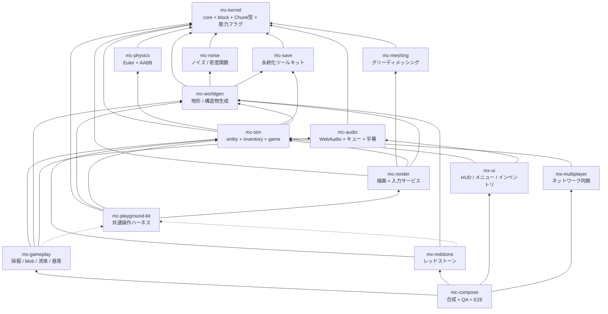

# アーキテクチャ

- 上位仕様: plan.md（**非公開**。§2 全体像、§3.3 mc-meshing）
- 参照実装: `takeokunn/ts-minecraft`（凍結。仕様書兼テストオラクル）

## 1. なぜ 16 リポジトリなのか

単一リポジトリ（参照実装は 84k LOC）では「正しく動くことが保証される単位」が大きすぎ、
検証しきれない。plan.md §1 の解決策は次の 1 行に尽きる:

> ゲーム UX を構成する体験単位ごとにリポジトリを分け、それぞれが「実際にユーザが操作できるプレビュー」を同梱する

各リポジトリは「テスト green + プレビューで目視確認済み」で正しさを単独で閉じ、
合成リポジトリ（mc-compose）は各モジュールを束ねるだけの場所になる。

## 2. 4 階層

| 階層 | リポジトリ | 性質 |
| --- | --- | --- |
| 安定ライブラリ | kernel / **noise** / **meshing** / **physics** / save / audio | 純粋関数・狭い界面・変更頻度が低い。相互独立で並行構築可能 |
| 基盤 | worldgen / sim / render / playground-kit | 状態とサービス（**名詞**）。体験モジュールが乗る土台 |
| 体験モジュール | gameplay / redstone / ui / multiplayer | ルールと UI（**動詞**）。互いを知らず、基盤サービス経由でのみ会話 |
| 合成 | compose | Layer マージ + stage 順序表 + E2E。ロジックを持たない |

## 3. 依存グラフ（全体）



実線 = 実行時依存（`dependencies`）、点線 = プレビュー起動時のみ（`devDependencies`）。
plan.md §2.1 は 15 リポジトリを図示しているが、Step 0 で **mc-dev-meta**（開発用 workspace、実行時依存なし）が加わるため、
org 標準の依存グラフの正典である `DEPENDENCY_POLICY.md` の roster は **16 行**である。

## 4. このリポジトリの位置

**mc-meshing は最下層に近い「安定ライブラリ」層に属する。**

- **親（このリポジトリが依存してよい先）**: `mc-kernel` のみ。
- **子（このリポジトリに依存する側）**: `mc-render` ただ 1 つ。

透過ブロック集合を `config` で注入する設計（plan.md §3.3）は、この位置取りの直接の帰結である。
「どのブロックが水で、どのブロックがガラスか」を知っているのはブロックテーブルを所有する側であり、
メッシャではない。注入にしておけば mc-meshing はブロックテーブルの所有者を知らずに済み、
依存グラフに余計な辺が生えない。

**mc-meshing は Three.js に依存してはならない。** 参照実装は `packages/world` の Three.js import を
ゼロに保っており（実測確認済み）、本計画はその分離を 1 段下で維持する。
ジオメトリは素の typed array であり、それを `BufferGeometry` にするのは mc-render の仕事である。

resource pack の境界も同じである。`domain/resource-pack-schema.ts` は対応する JSON 語彙を
`unknown` 値または JSON 文字列から検証して `ResourcePackAssets` に変換する。
`domain/resource-pack-resolver.ts` は loader を持たず、型付け済みの `ResourcePackAssets` を受け取り、
blockstate / model の解決結果を返す。
`domain/resource-pack-mesh.ts` はその結果を `ResourceModelQuad` に変換するが、filesystem / zip / PNG、
texture atlas、material、tint、GPU buffer は所有しない。

## 5. 構成の成立条件（plan.md §2.3）

### 5.1 基盤 = 名詞、体験 = 動詞（§2.3-1）

`InventoryService` のような**状態の置き場**は基盤層に置く。
「掘ったらドロップしてインベントリに入る」という**ルール**は体験層に置く。

体験モジュール（`mx-*`）間の依存エッジは**ゼロ**である。
「採掘 → インベントリに入る」は mx-gameplay が mx-ui を呼ぶのではなく、
mc-sim の `InventoryService` を経由して実現する。

このルールは `DEPENDENCY_POLICY.md` の roster に記録されており、
各リポジトリの `.oxlintrc.json` の `no-restricted-imports`(`pnpm lint` が検出する)が実効機構である。

安定ライブラリ層は名詞でも動詞でもなく**関数**である。状態を持たず、サービスを提供せず、
`Layer` を公開しない。この層に `Ref` が現れたら設計を疑うこと。

### 5.2 mc-playground-kit が devDependency 専用である理由（§2.3-2）

**実行時入力サービス（キーボード / マウス / ポインタロック / タッチ / キーリマッピング）を
所有するのは mc-render であって mc-playground-kit ではない。**

mc-playground-kit は「ミニ平地ワールド + カメラ + レンダラ + 入力を 1 秒で束ねる糊」であり、
各体験モジュールからは **devDependency としてのみ**参照される。
もし入力サービスを kit 側に置いたら、kit は出荷ビルドに含まれないので、
**本番ゲームから入力処理が丸ごと消える**。

したがって:

- `mc-playground-kit` が `dependencies` に現れたら CI は失敗する
  （DEPENDENCY_POLICY.md §3「`mc-playground-kit` の devDependency-only 例外」）。
- 出荷ソース（`src/index.ts` と `src/domain/`）からの import も失敗する。
- roster では **ノードとしては存在する**（kit 自身は worldgen / sim / render に実行時依存する）が、
  **どの行のターゲットにも現れない**。devDependency は実行時の辺を作らないので、循環にも参加しない。

なお mc-meshing は kit を devDependency としても使わない。プレビューを持たない層だからである。

### 5.3 stage 実行順序表は mc-compose が唯一所有する（§2.3-3）

各モジュールは `StageRegistration` で**順序制約（`after`）を宣言するだけ**であり、
全順序（total order）を解決するのは mc-compose ただ 1 つである。

```typescript
// mc-kernel が型を定義。各体験モジュールが実装して公開する
interface StageRegistration {
  readonly id: StageId
  readonly after?: ReadonlyArray<StageId>   // 順序制約の宣言のみ
  readonly run: (dt: DeltaTimeSecs) => Effect.Effect<void, never, FrameServices>
}
```

標準の全順序の骨格（plan.md §4.2）:

```
input
  -> simulation (physics -> interactions -> entities -> fluids -> redstone -> time/weather)
  -> camera-mirror
  -> chunk-sync
  -> render
  -> post-fx
  -> hud-sync
```

mc-meshing は stage を登録しない。メッシュ生成は毎フレームではなく
「チャンクが dirty になったとき」に走るものであり、その購読と発火は mc-render の
`WorldRenderer` が所有する（plan.md §3.9）。mc-meshing は純粋変換だけを提供する。

参照実装の轍: 合成層に 13k LOC のルールが堆積し、E2E でしか検証できなくなった。
「mc-compose の追加コードは Layer 合成と stage 順序表だけ」がレビュー規範である。

## 6. 依存グラフの実効機構（DEPENDENCY_POLICY.md §5）

org 標準では、リポジトリ間依存の許可グラフの実効機構は各リポジトリの `.oxlintrc.json` の
`no-restricted-imports` であり、`pnpm lint`(ひいては `pnpm verify`)がそのままハードゲートになる。
`mc-meshing` は Tier1(安定ライブラリ)なので、`.oxlintrc.json` は
普遍的な例外である `mc-kernel` を除くあらゆる `@nerima-games/*` import を禁止するパターンを持つ。

| ルール | 内容 |
| --- | --- |
| ハード失敗 | 違反があれば `pnpm lint`(`--deny-warnings`)が必ず非ゼロ終了する |
| 循環禁止・推移閉包禁止・kernel 例外・宣言と実体の一致・kit の devDependency 専用 | いずれも `DEPENDENCY_POLICY.md` §2 が定める org 共通ルール(本リポジトリは Tier1 なので、`mc-kernel` 以外の `@nerima-games/*` への依存を持たない) |

かつては 16 リポジトリ共通のテンプレートスクリプト(`scripts/check-dependency-whitelist.ts` +
専用テスト + `pnpm check:deps`)がこの役割を担っていたが、org 標準の策定に伴い撤去された
(PACKAGE_STANDARD.md「`scripts/check-dependency-whitelist.ts` の廃止」)。`Date.now()` 直接呼び出し
の禁止のように現行の Nix devShell の oxlint がまだ実装していないチェック
(`no-restricted-syntax` / `no-restricted-properties` / `no-restricted-globals` のいずれも
未実装であることを実測確認済み)は、
org 標準としては個別リポジトリの裁量に委ねられており、本リポジトリでは現在専用の代替スクリプトを
持たない。

## 7. 依存宣言とkernel境界

`@nerima-games/mc-kernel` は `dependencies` に固定され、`Chunk` の
`coord` / `height` という共有語彙を型として参照する。mc-meshing固有の
`ChunkView` はレンダラー向けの可変高さビューとして、座標と高さに加えて
メッシング用の byte view を保持する。kernel の opaque な `blocks` は、呼び出し側が
境界で `Uint8Array` にコピーして渡し、`blockCount` が高さを検証して必要な長さを算出する。
高さを固定値へ切り詰めたりパディングしたりする変換は行わない。

この依存境界により、共有語彙はmc-kernel、メッシング用の `ChunkView` と面生成は
mc-meshingが所有する。resource pack の JSON 入力は mc-meshing が定義するデータ契約であり、読み込み元は
上位の asset pipeline が所有する。依存グラフの制約は `DEPENDENCY_POLICY.md` の roster に従う。

## 参照

- `responsibility.md` — このリポジトリの責務と、意図的に含めないもの
- `public-api.md` — 公開 API と参照実装での裏付け
- `design-notes.md` — 設計注意とその回帰テスト名
- `versioning.md` — 0.x → 1.0.0 の方針と publish
